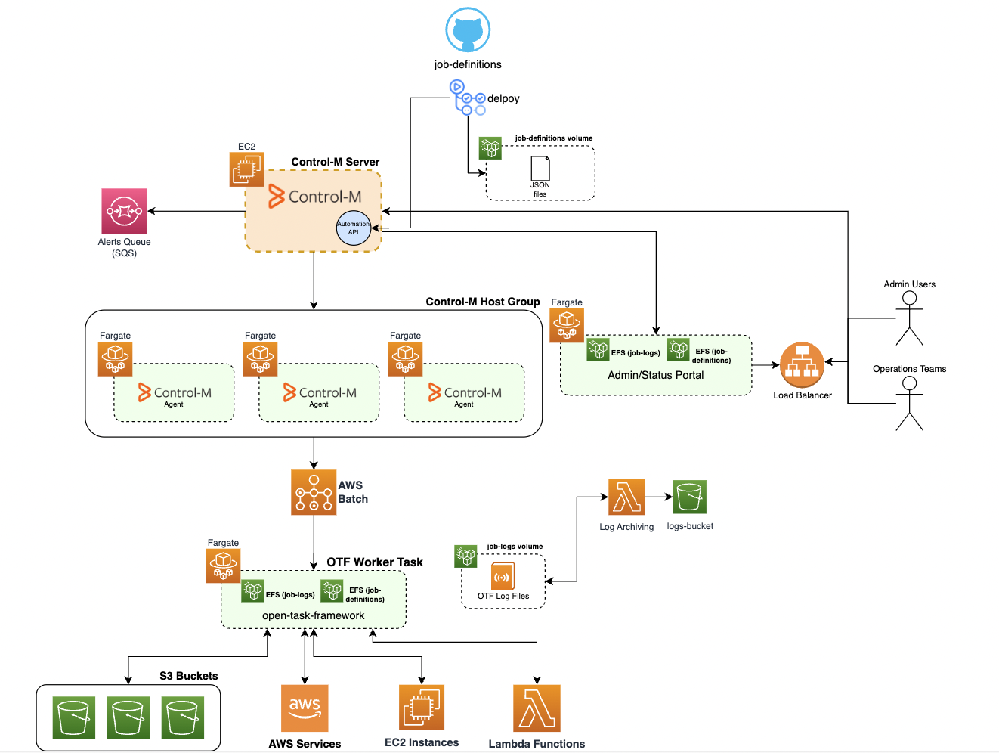

[](https://pypi.org/project/opentaskpy/)

[](https://codecov.io/gh/adammcdonagh/open-task-framework)
[](https://github.com/adammcdonagh/open-task-framework/blob/master/LICENSE)
[](https://github.com/adammcdonagh/open-task-framework/issues)
[](https://github.com/adammcdonagh/open-task-framework/stargazers)

<h1>Open Task Framework (opentaskpy)</h1>

- [Installation](#installation)
  - [Example Deployment](#example-deployment)
- [Configuration](#configuration)
  - [Command Line Arguments](#command-line-arguments)
  - [otf-batch-validator](#otf-batch-validator)
  - [Environment Variables](#environment-variables)
  - [Logging](#logging)
  - [Variables](#variables)
  - [Runtime Overrides](#runtime-overrides)
  - [Lookup plugins](#lookup-plugins)
    - [Adding your own](#adding-your-own)
    - [Example Variables](#example-variables)
- [Task Definitions](#task-definitions)
  - [Transfers](#transfers)
  - [Executions](#executions)
  - [Batches](#batches)
- [Development](#development)
  - [Quickstart for development](#quickstart-for-development)
    - [Building and uploading to PyPi](#building-and-uploading-to-pypi)
  - [Official Addons/Plugins](#official-addonsplugins)
    - [otf-addons-aws](#otf-addons-aws)
  - [Developing your own addon/plugin](#developing-your-own-addonplugin)
    - [Lookup Plugins](#lookup-plugins-1)
    - [Addons](#addons)

Open Task Framework (OTF) is a Python based framework to make it easy to run predefined file transfers and scripts/commands on remote machines.

Currently the framework is primarily based around being able to use SSH or SFTP to communicate with remote hosts in order to manipulate files and run commands. This is done via the use of SSH keys, which must be set up in advance.

OTF has 3 main concepts for tasks. These are:

- Transfers
- Executions
- Batches

For more details, see the [task types](docs/task-types.md) doc

# Installation

OTF can be run either as an installed script, or via a docker container

Install via pip:

```shell
pip install opentaskpy
```

The `task-run` script will be added to your PATH, and you can invoke it directly.

To run via docker, use the `Dockerfile` to create your own base image using just the standard opentaskpy library. However if you want to install addons, you'll need to customise this, to install the additional packages first, before bundling it as a Docker image.

```shell
docker build -t opentaskpy -f Dockerfile . # Build the image
docker run --rm --volume /opt/otf/cfg:/cfg --volume /var/log/otf:/logs--volume /home/<USER>/.ssh/id_rsa:/id_rsa -e OTF_SSH_KEY=/id_rsa -e OTF_LOG_DIRECTORY=/logs task-run -t <TASK NAME> -c /cfg # Run a task
```

The default `opentaskpy` library is only really designed to use SSH for executions and file transfers. To do this, you need to make sure that the host/container that is running the `task-run` script has a private RSA key, that is trusted on all remote hosts that you're running against.

An environment variable `OTF_SSH_KEY` can be used to define a default SSH key to use for all SSH connectivity. This can be overridden at the transfer/execution level by specifying a `keyFile` in the `credentials` section of the protocol definition.

## Example Deployment

This is an example deployment for using OTF in an AWS environment, using BMC Control-M as the job scheduler. Control-M could be replaced with any job scheduler, AWS EventBridge for example, depending on your requirements.



"Admin/Status Portal" currently does not exist, and is a placeholder for a potential further project to visualise the OTF configs, as well as including real-time job statuses from the job scheduler.

# Configuration

There are several ways to customise the running of tasks.

## Command Line Arguments

The following details the syntax of the `task-run` command:

```
usage: task-run [-h] -t TASKID [-r RUNID] [-v VERBOSITY] [-c CONFIGDIR]

options:
  -h, --help            show this help message and exit
  --noop                Do not attempt to run anything. Only load the config files to validate that they're OK
  -t TASKID, --taskId TASKID
                        Name of the JSON config to run
  -r RUNID, --runId RUNID
                        Unique identifier to correlate logs with. e.g. if being triggered by an external scheduler
  -v VERBOSITY, --verbosity VERBOSITY
                        Increase verbosity
  -c CONFIGDIR, --configDir CONFIGDIR
                        Directory containing task configurations
```

**--noop**

This is useful for validating the configuration is valid. It will not actually do anything, other than load the configuration files and validate that they are valid. N.B. This only works for executions and transfers.

**-t, --taskId**

This relates to the specific task that you want to run. It is the name of the configuration file to load (without the `.json` or `.json.j2` suffix), contained under the `CONFIGDIR`

**-r, --runId**

A log aggregation mechanism to bundle logs for several steps in a batch together. e.g. if you pass in `-r some_job_name`, the log files for all executions and transfers will be placed under `<logdir>/some_job_name/`

**-v, --verbosity**

There are 3 levels of logging, beyond the default INFO level. These are VERBOSE1 (1), VERBOSE2 (2), and DEBUG (3).

VERBOSITY is an integer; 1, 2 or 3

**-c, --configDir**

The directory containing all of the config files. These are the task definition JSON files, as well as the variables Jinja2 template file.

In order for the process to run, you must have at least one task, and a `variables.json.j2` file, even if it's just an empty object definition

## otf-batch-validator

This is a script that can be used to validate the configuration of a batch. It will check that all tasks are defined consecutively, and that there are valid dependencies. It will also check that all tasks are defined in the `configDir` directory.

It is run as follows:

```shell
otf-batch-validator -c /path/to/configDir -t batch-task-name
```

Full list of arguments are as follows:

```
usage: otf-batch-validator [-h] -t TASKID [-v VERBOSITY] [-c CONFIGDIR]

options:
  -h, --help            show this help message and exit
  -t TASKID, --taskId TASKID
                        Name of the JSON config to run
  -v VERBOSITY, --verbosity VERBOSITY
                        Increase verbosity: 3 - DEBUG 2 - VERBOSE2 1 - VERBOSE1
  -c CONFIGDIR, --configDir CONFIGDIR
                        Directory containing task configurations
```

## Environment Variables

These are some environment variables that can be used to customise the behaviour of the application. There are some internally used variables too, but changing them without a full understanding of the code is not advised.

- `OTF_NO_LOG` - Disable logging to file. Only log to stderr. Set to `1` to enable
- `OTF_LOG_JSON` - Stderr logging will be in JSON format. Set to `1` to enable
- `OTF_LOG_DIRECTORY` - Path under which log files are written
- `OTF_RUN_ID` - (meant for internal use) An aggregator for log files. When set, all log files for a run will go under this sub directory. E.g. running a batch, all execution and transfer logs will be dropped into this sub directory, rather than a directory for each task name. This is equivalent to using `-r` or `--runId` command line arguments, which is generally preferred.
- `OTF_SSH_KEY` - The private SSH key to use by default for all SSH connections. This is essential when using a basic docker container to trigger OTF. If not specified, it will default to use any private SSH keys available to the user executing the application.
- `OTF_STAGING_DIR` - Staging base directory to place files before they're dropped into their final location. Default is `/tmp`
- `OTF_BATCH_RESUME_LOG_DATE` - Allow resuming of batch runs from a specific date. This is useful if you want to rerun a batch from a specific date, especially if the failure happens just after midnight and the date is no longer the same as the original run. Date format is `YYYYMMDD`
- `OTF_VARIABLES_FILE` - Override the default variables file. This is useful when you want to use the same job definitions, but point at a different environment with different for example.

## Logging

By default, OTF will log to a directory called `logs` in the current working directory. For the docker containers, unless overridden by `OTF_LOG_DIRECTORY`, it will write to `/logs` using a symlink at `/app/logs`

## Variables

Variables can exist at a global level, and also on a per-task basis.

You must always have a `variables.json.j2` file defined at the root of your `configDir`.

Variables can be used using the Jinja2 template syntax within task definitions. They can also be nested.

Individual tasks can have their own local variables too

## Runtime Overrides

Sometimes you might want to override the current date, or something specific about a file transfer when you manually run a task. This can be done using environment variables.

Standard global variables can be overridden simply by setting an environment variable that matches the name of the variable you want to override e.g. `export DD=01`
In the log output, you'll see something like this:

```
Overriding global variable (DD: 05) with environment variable (01)
```

To override task specific values, you can use the following format in the environment variable name:
`OTF_OVERRIDE_<TASK_TYPE>_<ATTRIBUTE>_<ATTRIBUTE>_<ATTRIBUTE>`

e.g. `OTF_OVERRIDE_TRANSFER_SOURCE_HOSTNAME`

Case doesn't matter here. For attributes that are nested within an array, you can specify the array index

e.g. `OTF_OVERRIDE_TRANSFER_DESTINATION_0_PROTOCOL_CREDENTIALS_USERNAME`

Again this will be logged to show you that the override is being applied.

## Lookup plugins

Static variables are useful, however sometimes you need to look up something a bit more dynamic, or secret, that you don't want to hard code into the variables file.

There are 2 default lookup plugins available:

- File
- HTTP JSON

The file plugin will load the content of a file into the variable e.g.

```jinja
"{{ lookup('file', path='/tmp/variable_lookup.txt') }}"
```

The HTTP JSON plugin will perform a very basic HTTP GET request, expecting a JSON response. The value to extract is defined by a jsonpath e.g.

```jinja
"{{ lookup('http_json', url='https://jsonplaceholder.typicode.com/posts/1', jsonpath='$.title') }}"
```

This will hit the typicode.com side, and extract the title attribute from from the returned JSON file

### Adding your own

OTF will look for plugins that are either available as an installed module (under the `opentaskpy.plugins.lookup` namespace), or dropped in a `plugins` under the config directory.

An example Python module might be: `opentaskpy.plugins.lookup.aws.ssm`. This can then be referenced as a variable in a template like so:

```jinja
"{{ lookup('aws.ssm', name='my_test_param') }}"
```

Alternatively a lookup plugin could be placed under `cfg/plugins` named `my_lookup.py`, and used in a template:

```jinja
"{{ lookup('my_lookup', name='my_param') }}"
```

### Example Variables

Below are examples of some useful variables to start with:

```json
"YYYY": "{{ now().strftime('%Y') }}",
"MM": "{{ now().strftime('%m') }}",
"DD": "{{ now().strftime('%d') }}",
"TODAY": "{{ YYYY }}{{ MM }}{{ DD }}",
"MONTH_SHORT": "{{ now().strftime('%b') }}",
"DAY_SHORT": "{{ now().strftime('%a') }}",
"PREV_DD": "{{ (now()|delta_days(-1)).strftime('%d') }}",
"PREV_MM": "{{ (now()|delta_days(-1)).strftime('%m') }}",
"PREV_YYYY": "{{ (now()|delta_days(-1)).strftime('%Y') }}"
```

Usage:

```json
"fileRegex": "somefile.*{{ YYYY }}\\.txt"
```

`now` is added by OTF, it will return a `datetime` object aligned to whatever timezone the worker is running. If you need the UTC time, then you can use `utc_now` instead.

# Task Definitions

Task definitions are validated using the JSON Schemas defined within `src/opentaskpy/config/schemas/`. These are split up to make them more readable. The top level schema for each task type is defined within the `schemas.py` file, one level above.

At a later date, I plan to automate the creation of the JSON schema documentation.

The task definitions themselves live under the `cfg` directory, and any number of sub directories under there to allow for grouping of tasks by whatever you like. Definitions can be either a plain JSON file, or a Jinja2 template. If a template is used, it must have the `.j2` suffix. JSON files may also use internal variables, this is not supported when using `.j2` task definitions.

## Transfers

Transfers consist of a `source` definition, and an optional `destination`.

The easiest way to see usage is to look at the examples under the `examples` directory

Below is an example of all the options available for a transfer:

```json
{
  "type": "transfer",
  "source": {
    "hostname": "{{ HOST_A }}",
    "directory": "/tmp/testFiles/src",
    "fileRegex": ".*\\.txt",
    "fileWatch": {
      "timeout": 15,
      "directory": "/tmp/testFiles/src",
      "fileRegex": "fileWatch\\.txt"
    },
    "logWatch": {
      "timeout": 15,
      "directory": "/tmp/testFiles/src",
      "log": "log{{ YYYY }}Watch1.log",
      "contentRegex": "someText[0-9]",
      "tail": true
    },
    "conditionals": {
      "size": {
        "gt": 10,
        "lt": 20
      },
      "age": {
        "gt": 60,
        "lt": 600
      }
    },
    "postCopyAction": {
      "action": "move",
      "destination": "/tmp/testFiles/archive"
    },
    "protocol": {
      "name": "ssh",
      "credentials": {
        "username": "{{ SSH_USERNAME }}"
      }
    }
  },
  "destination": [
    {
      "hostname": "{{ HOST_B }}",
      "directory": "/tmp/testFiles/dest",
      "permissions": {
        "group": "operator"
      },
      "protocol": {
        "name": "ssh",
        "credentials": {
          "username": "{{ SSH_USERNAME }}"
        }
      }
    },
    {
      "hostname": "{{ HOST_B }}",
      "directory": "/tmp/testFiles/dest",
      "transferType": "pull",
      "rename": {
        "pattern": "^(.*)\\.txt$",
        "sub": "\\1-2.txt"
      },
      "protocol": {
        "name": "ssh",
        "credentials": {
          "username": "{{ SSH_USERNAME }}",
          "transferUsername": "{{ SSH_USERNAME }}"
        }
      }
    }
  ]
}
```

An explanation of what's going on in the order it will handled:

1. Tail the log file matching named: `/tmp/testFiles/src/log{{ YYYY }}Watch1.log` for lines matching containing the regex `someText[0-9]`, for up to 15 seconds, before giving up.
2. Poll for a file matching the regex `/tmp/testFiles/src/fileWatch\.txt` for up to 15 seconds.
3. Find all files matching the regex `/tmp/testFiles/src/.*\.txt`, with the conditions that the are >10B and <20B in size, as well as being older than 60 seconds, but newer than 600 seconds since last modification
4. Transfer the files that were found to 2 destinations.
   1. The first destination is a simple SCP from `HOST_A` to `HOST_B` where the file is placed under `/tmp/testFiles/dest`. The group ownership of the file(s) is then set to `operator`
   2. The second destination is done via a pull from the destination server into the same directory. The SCP connects to `HOST_A` as `transferUsername`. Once the file has been retrieved, it is renamed using the following regex match `^(.*)\.txt$` and substitution `\1-2.txt`
5. Transferred files are moved into `/tmp/testFiles/archive` on `HOST_A`

## Executions

Executions are the simplest task to configure. They consist of a list of hosts to run on, the username to run/connect as, and the command to run.

Executions do not currently have a timeout, so can in theory run forever, or until they are killed. If a timeout is required, either use a wrapper script on the host the command is being executed on, or they should be wrapped inside a batch.

```json
{
  "type": "execution",
  "hosts": ["{{ HOST_A }}"],
  "directory": "/tmp/testFiles/src",
  "command": "touch touchedFile.txt",
  "protocol": {
    "name": "ssh",
    "credentials": {
      "username": "{{ SSH_USERNAME }}"
    }
  }
}
```

The above is running the command `touch touchedFile.txt` on `{{ HOST_A }}`, from within the `/tmp/testFiles/src` directory.

If multiple `hosts` are defined, a thread is spawned in parallel for each host. If the command fails on any of the hosts in the list, it will cause the task run to fail, once all processes have returned a result.

## Batches

Batches are a little more complex. They do not contain any task definitions, only the list, and order of execution for each task.

A batch task can have multiple options set that determine the execution order and conditions, as well as how failures and task reruns are handled.

Each task in a batch has an `order_id`, this is a unique ID for each task, and is primarily used to define dependencies.

`dependencies` can be applied to any task, and are simply a list of other tasks that must be completed before it is triggered.

`continue_on_fail` is a boolean that defines whether a failure would cause the whole batch to fail immediately (after existing tasks have finished executing), or whether following steps get run. This defaults to false if not defined.

`retry_on_rerun` is a boolean that determines whether a successful task is run a second time following a failed run. If a batch exits with a failure, and then the script is reun later on that same day, by default only the steps that failed will be run. All steps can be forced to run by setting this to true

`timeout` specifies the number of seconds a task is allowed to be running before it gets terminated. This counts as a failure. The default timeout, if not specified is 300 seconds.

As a batch task runs, it writes out the status of each sub task to it's log file. If a failure occurs, and the batch is rerun with the same arguments, it will attempt to resume from the point of failure. To determine the previous state, the batch handler will look at only logs that are from the current date. This is tp ensure that if something failed at 1am yesterday, but hasn't been rerun, we won't try to recover from the point of failure. Sometimes you might want to recover regardless, this can be done by passing in the date of the log files that you want to recover from, using the environment variable `OTF_BATCH_RESUME_LOG_DATE` in the format `YYYYMMDD`. This will instruct the batch handler to look at logs with that date instead.

# Development

This repo has been primarily configured to work with GitHub Codespaces devcontainers, though it can obviously be used directly on your machine too.

Dev and runtime packages are defined via pipenv, with a `requirements.txt` for the runtime package requirements

## Quickstart for development

- Clone this repo
- pip install pipenv
- pipenv --python 3.10 && pipenv install && cd src && pipenv install --editable .

### Building and uploading to PyPi

```bash
python3 -m build
python3 -m twine upload --repository testpypi dist/*
```

## Official Addons/Plugins

Here's a list of official addons:

### [otf-addons-aws](https://github.com/adammcdonagh/otf-addons-aws)

Provides transfer and execution addons:

- Remote handler for interacting with AWS S3 buckets
- Remote handler for executing AWS Lambda functions

Lookup plugins:

- Support for AWS SSM Parameter Store for retrieving global variables

## Developing your own addon/plugin

### Lookup Plugins

Plugins are very simple. They simply need a `run` function, and to return the required variable based on a list of kwargs provided within the config template.

3 examples are bundled by default. The simplest of which is the `random` plugin, which takes 2 numbers and returns a random number between the 2.

They should either be installed as a python package and accessible to load as a module, or stored within the config directory under a `plugins` directory.

They must sit under the `opentaskpy.plugins.lookup` namespace. The filename must match the name of the plugin being references from the template lookup function.

### Addons

Addons allow you to write your own interfaces with other types of remote systems. This could be a custom database provider to allow you to run stored procedures on demand, or something like AWS to perform custom transfers

Addons can either be a transfer type, or execution, and must follow the same rules. They should implement all of the functions in the abstract `RemoteTransferHandler` or `RemoteExecutionHandler` class, or return a `NotImplementedError` exception.

You should also ensure that you define an appropriate JSON schema, and include those under the `opentaskpy.addons.XXXX.remotehandlers.schemas` directory

Addons can technically be named under any namespace, but must be referred to using the full package name in the task definition e.g. `opentaskpy.addons.aws.remotehandlers.lambda.LambdaExecution`
