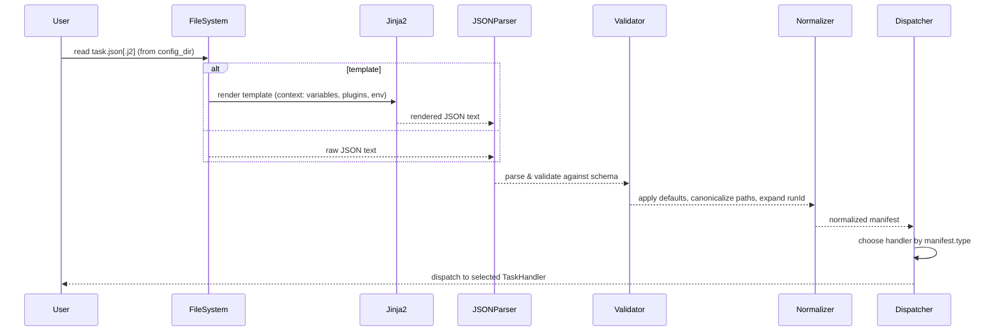
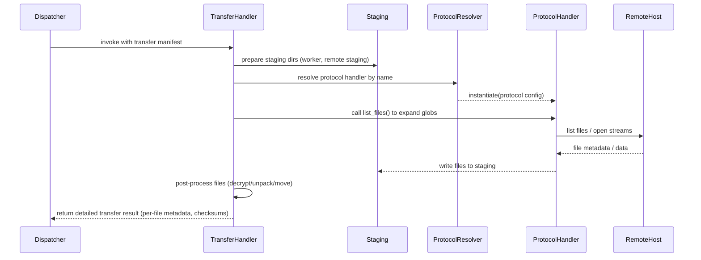
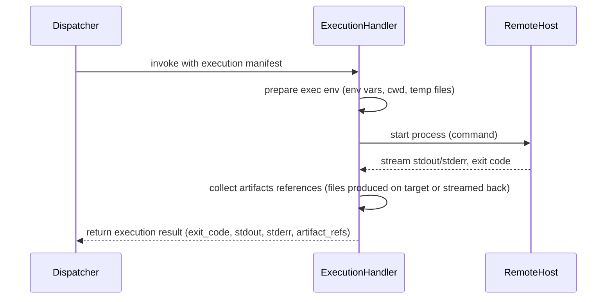
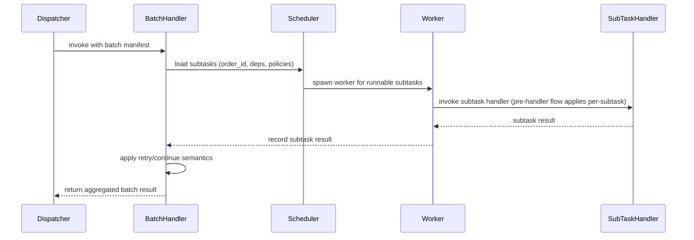

# Architecture — Open Task Framework

This document explains how the framework is organized and how components interact at runtime.

## Table of contents

- [Architecture — Open Task Framework](#architecture--open-task-framework)
  - [Table of contents](#table-of-contents)
  - [Core components](#core-components)
  - [Runtime flows](#runtime-flows)
    - [Pre-handler flow (common)](#pre-handler-flow-common)
    - [Transfer handler flow (post-handler)](#transfer-handler-flow-post-handler)
    - [Execution handler flow (post-handler)](#execution-handler-flow-post-handler)
    - [Batch handler flow (post-handler)](#batch-handler-flow-post-handler)
  - [Variable resolution \& templates](#variable-resolution--templates)
  - [Architecture diagrams (Mermaid + sequences)](#architecture-diagrams-mermaid--sequences)
    - [Startup / Pre-handler sequence](#startup--pre-handler-sequence)
    - [Transfer handler sequence](#transfer-handler-sequence)
    - [Execution handler sequence](#execution-handler-sequence)
    - [Batch handler sequence](#batch-handler-sequence)
  - [Where to look in the codebase](#where-to-look-in-the-codebase)

## Core components

- `taskhandler` (in `src/opentaskpy/taskhandlers`)

  - Receives a validated task manifest (execution/transfer/batch), orchestrates the workflow, sets up staging, and gathers results.
  - Delegates protocol-specific actions to remote handlers.

- `remotehandlers` (in `src/opentaskpy/remotehandlers`)

  - Abstract `RemoteHandler` classes define the contract for execution and transfer operations.
  - Concrete implementations (SSH, SFTP, local, email, dummy) implement the protocol specifics.

- `plugins` (in `src/opentaskpy/plugins`)

  - Small, reusable helpers that can be used inside tasks (e.g., `lookup.file`, `lookup.http_json`, `lookup.random_number`).

- `config/schemas` — JSON schemas define valid task payloads and protocol configuration.

## Runtime flows

### Pre-handler flow (common)

This flow describes the logic that always happens before any specific handler (transfer/execution/batch) is invoked. It's the common preparation and validation pipeline.

1. Discover task manifest file (`.json` or `.json.j2`) in the configured `config_dir`.
2. Read the file from disk.
3. If the file is a Jinja2 template (`.json.j2`) render it using the template context (variables, lookup plugins, environment overrides).
4. Parse the rendered text as JSON.
5. Validate the parsed JSON against the appropriate schema in `src/opentaskpy/config/schemas/` (execution/transfer/batch schema).
6. Normalize runtime fields: set defaults, canonicalize paths, expand runId if missing, and evaluate any top-level plugin calls that must run pre-handler.
7. Instantiate a `TaskRun` / `TaskHandler` which will dispatch to the specific handler type based on the manifest's top-level `type` field.

After the pre-handler flow completes, control is transferred to the selected handler. The three flows below show what each handler typically performs once it's invoked.

### Transfer handler flow (post-handler)

This flow documents the behavior after `TransferTaskHandler` is invoked.

1. `TransferTaskHandler` prepares staging directories (worker workspace and optional remote staging areas).
2. For each transfer item in the manifest:

- Resolve the protocol handler by its `name` (module path) and instantiate it with the protocol config.
- Call `list_files()` when needed to expand globs or remote directories.
- Depending on `direction` call `pull_files_to_worker()` (remote -> worker) or `push_files_from_worker()` (worker -> remote).
- Handlers may return metadata (size, checksums, timestamps) and may stream file contents or place them into staging.

3. `TransferTaskHandler` applies optional post-processing (decrypt, unpack, move to final location) and records per-file results.

### Execution handler flow (post-handler)

This flow documents the behavior after `ExecutionTaskHandler` is invoked.

1. Resolve the configured execution handler implementation and instantiate it with provided config.
2. Call `execute()` with the command payload. The execution handler is expected to:

- Start the command/process on the target (local or remote), streaming stdout/stderr back to the handler.
- Optionally provide a PID or process identifier for later lookup or termination.
- Respect timeouts and kill signals provided by the caller.

4. Collect the exit code, stdout, stderr, and any structured outputs (files written to staging, JSON result objects).
5. Apply any configured result parsing (e.g., parse JSON output, extract return artifacts) and persist or move artifacts as specified.

### Batch handler flow (post-handler)

This flow documents the behavior after `BatchTaskHandler` is invoked.

1. `BatchTaskHandler` loads the list of subtasks and their metadata (order_id, dependencies, retry_on_rerun, continue_on_fail, timeout).
2. Validate individual subtask manifests (each subtask goes through the Pre-handler flow for its own manifest when executed).
3. Schedule runnable subtasks (those with no unmet dependencies) and spawn worker threads/processes to run them concurrently according to configured concurrency.
4. For each subtask execution:

- The Batch handler invokes the appropriate subtask handler (Transfer, Execution or Batch) which follows its post-handler flow.
- Monitor progress, apply timeouts, and capture per-subtask results.
- If a subtask fails, apply `continue_on_fail` and `retry_on_rerun` semantics as configured.

5. Aggregate subtask results into a final batch report with success/failure counts, timings, and produced artifacts.
6. Return the batch summary result to the caller.

## Variable resolution & templates

- Files: task manifests and config artifacts are JSON-based. They are either plain `.json` files or Jinja2 templates with a `.json.j2` extension.
- Pipeline when loading a task/config file:
  1. Read the `.json` or `.json.j2` file from disk.
  2. If `.json.j2`, render using Jinja2 with the available template context (variables, plugin helpers, environment values).
  3. Parse the rendered text as JSON.
  4. Validate parsed JSON against the relevant schema in `src/opentaskpy/config/schemas/`.

Templates can call lookup plugins and small helpers (see `src/opentaskpy/plugins/lookup/`) but must render to valid JSON.

## Architecture diagrams (Mermaid + sequences)

Below are a set of diagrams broken into a startup/pre-handler sequence and three handler-specific sequences (Transfer, Execution, Batch). Each Mermaid sequence focuses on the responsibilities that occur in that phase; compact textual summaries follow each Mermaid block.

### Startup / Pre-handler sequence

This sequence shows the logic from file discovery up to the point where a TaskHandler (transfer/execution/batch) is selected and invoked. The compact summary below preserves the important parsing/validation/normalization steps.

Pre-handler summary:

- read file (.json or .json.j2) from `config_dir`
- if `.json.j2`, render with Jinja2 using template context (lookup plugins, env overrides)
- parse rendered text as JSON and validate against the appropriate schema in `src/opentaskpy/config/schemas/`
- apply normalization: defaults, path canonicalization, runId generation
- dispatch to the appropriate handler based on `manifest.type`

### Transfer handler sequence

Shows the transfer handler's main interactions once invoked; transfer-specific parsing/expansion is performed here (e.g., list_files, globs, staging semantics).

Compact transfer summary:

- prepare staging and protocol handler
- list_files() to expand globs or remote directories
- pull_files_to_worker() or push_files_from_worker() to move file data via ProtocolHandler
- write files into staging, post-process (decrypt/unpack), and return per-file metadata

### Execution handler sequence

Shows how an execution handler runs a command and reports results.

Compact execution summary:

- prepare execution environment locally in the execution handler (env, working dir, temp files)
- start command on target and stream logs back to the handler
- collect exit code and either reference or transfer produced artifacts as configured
- return composed execution result (including artifact references, stdout/stderr, exit_code)

### Batch handler sequence

Shows batch scheduling and how subtasks are delegated and aggregated.

Compact batch summary:

- load & validate subtasks, then schedule runnable ones
- run each subtask through the pre-handler flow and its chosen handler
- monitor, apply timeouts/retries, aggregate results and artifacts
- return final batch report

## Where to look in the codebase

- `src/opentaskpy/taskhandlers/` (orchestrators)
- `src/opentaskpy/remotehandlers/` (implementations)
- `src/opentaskpy/plugins/lookup/` (examples of small plugin implementations)
- `src/opentaskpy/config/schemas/` (schemas)
- `tests/` and `test/` (unit tests & integration fixtures)
